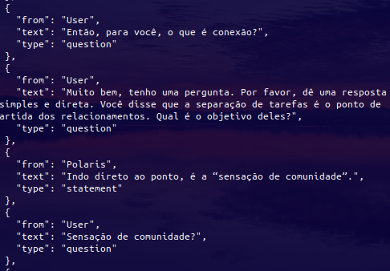
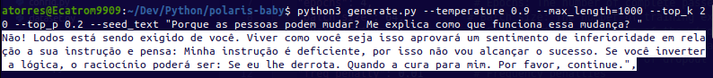

<h1 align="center">Tech Tweakers - Polaris Baby LLM </h1>
<p align="center"><i>Learning project to build a tiny LLM model from scratch.</i></p>

<div align="center">
  <a href="https://github.com/Tech-Tweakers/polaris-baby/stargazers"></a>
<a href="https://github.com/Tech-Tweakers/polaris-baby/network/members"></a>
<a href="https://github.com/Tech-Tweakers/polaris-baby/pulls"></a>
<a href="https://github.com/Tech-Tweakers/polaris-baby/issues"></a>
<a href="https://github.com/Tech-Tweakers/polaris-baby/graphs/contributors"></a>
<a href="https://github.com/Tech-Tweakers/polaris-baby/blob/master/LICENSE"></a>
</div>

<br>
<p align="center"><i>Got problems or have some time to help? Please open an <a href="https://github.com/Tech-Tweakers/polaris-baby/issues/new">Issue</a> to tell us!</i></p>

# About

Polaris Baby is a custom language model developed using PyTorch. This project encompasses scripts for training the model on a character-level dataset and executing inference with the trained model. The development of Polaris Baby LLM serves educational purposes.

# Latest Inference

| Original Input | Latest Inference |
| -------------- | ---------------- |
|  |  |

## Overview

Polaris LLM demonstrates the process of building a language model from the ground up, showcasing the intricacies of model architecture and training. It provides hands-on experience with advanced concepts in natural language processing and deep learning.

## Getting Started

### Prerequisites
- Python 3.x
- PyTorch
- NumPy
- Pandas 

### Installation

Clone the repository to your local machine:

```bash
git clone https://github.com/Tech-Tweakers/polaris-baby.git
cd polaris-baby
```

### Training the Model

1 - **Prepare your dataset**: The dataset should be a text file where the text data is used for training the model. The input file should be placed in the root directory. In the **Makefile** there is some functions to improve the dataset, like removing special characters, strings, add tags, etc.

2 - **Adjust the training configuration**: The training configuration can be adjusted in the **config.py** file. The configuration includes parameters like batch size, learning rate, and number of epochs.

```python
# config.py

HP = {
    "embed_dim": 64,
    "hidden_dim": 128,
    "num_layers": 2,
    "learning_rate": 0.05,
    "epochs": 5,
    "batch_size": 64,
    "loss_threshold": 0.4,
    "context_window": 128,
    "log_interval": 64,
    "vocab_size": None,
    "vocab": None,
    "val": None,
    "encoded_text": None,
    'stop_batch': 15000,     
}
```

3 - **Run the training script**: The training script will train the model and save the trained model to the models directory. The script will also monitor performance metrics. The script can be run with the following command:

```bash
python main.py
```

### Inference

After training, use the generate.py script for generating text:

1 - Load the trained model: Ensure that the trained model .pth file is accessible to the script.

2 - Run the inference script:

```bash
usage: generate.py [-h] [--seed_text SEED_TEXT] [--max_length MAX_LENGTH] [--temperature TEMPERATURE] [--top_k TOP_K] [--top_p TOP_P]

Generate text using a trained model.

options:
  -h, --help            show this help message and exit
  --seed_text SEED_TEXT
                        Initial text to start generating from.
  --max_length MAX_LENGTH
                        Maximum length of the generated text.
  --temperature TEMPERATURE
                        Temperature for sampling.
  --top_k TOP_K         Top-k filtering threshold.
  --top_p TOP_P         Top-p (nucleus) filtering threshold.
```

## Dataset and Vocabulary

The dataset file used for training **must be the same file** to be used for the Vocabulary. The Vocabulary is generated from the dataset file and is used to encode the text data into integers. If you train the model on one dataset and then try to use a different Vocabulary for inference, the model will not be able to decode the text data.

## Model Architecture

The model architecture is a simple LSTM-based language model. The model is trained to predict the next character in a sequence of characters. The model is trained using teacher forcing, where the input to the model is the sequence of characters and the target is the sequence of characters shifted by one position. The model is trained to minimize the cross-entropy loss between the predicted sequence and the target sequence. 

## Contributing

Contributions to Polaris Baby LLM are welcome. Please read CONTRIBUTING.md for guidelines on how to contribute.
